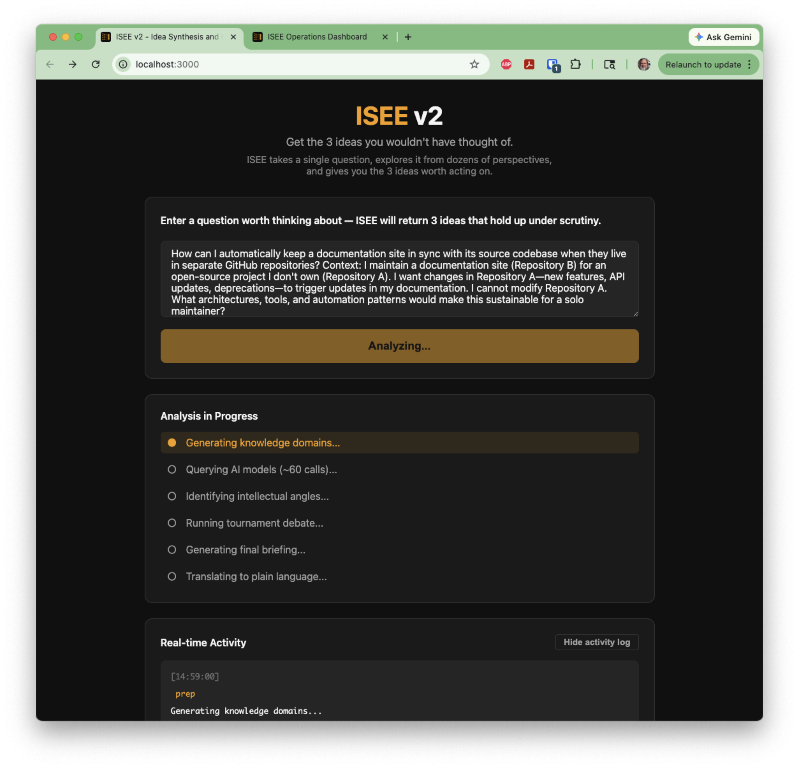
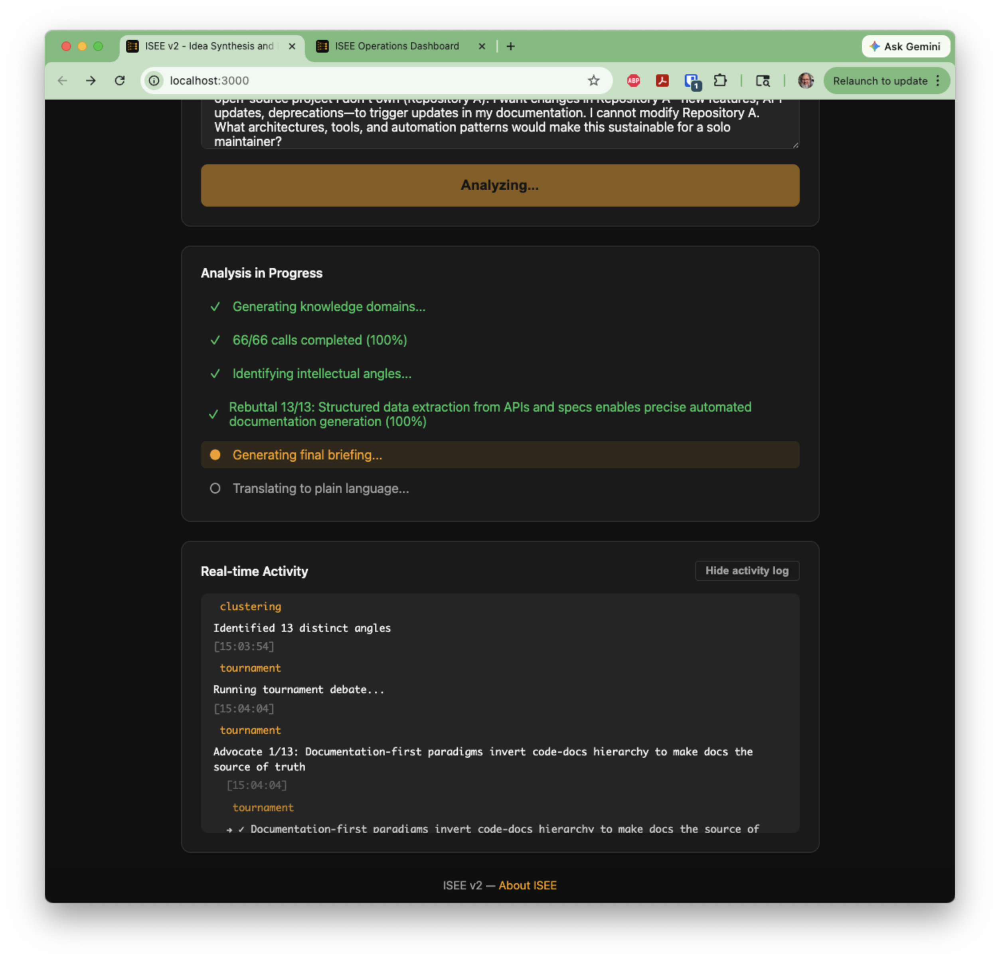
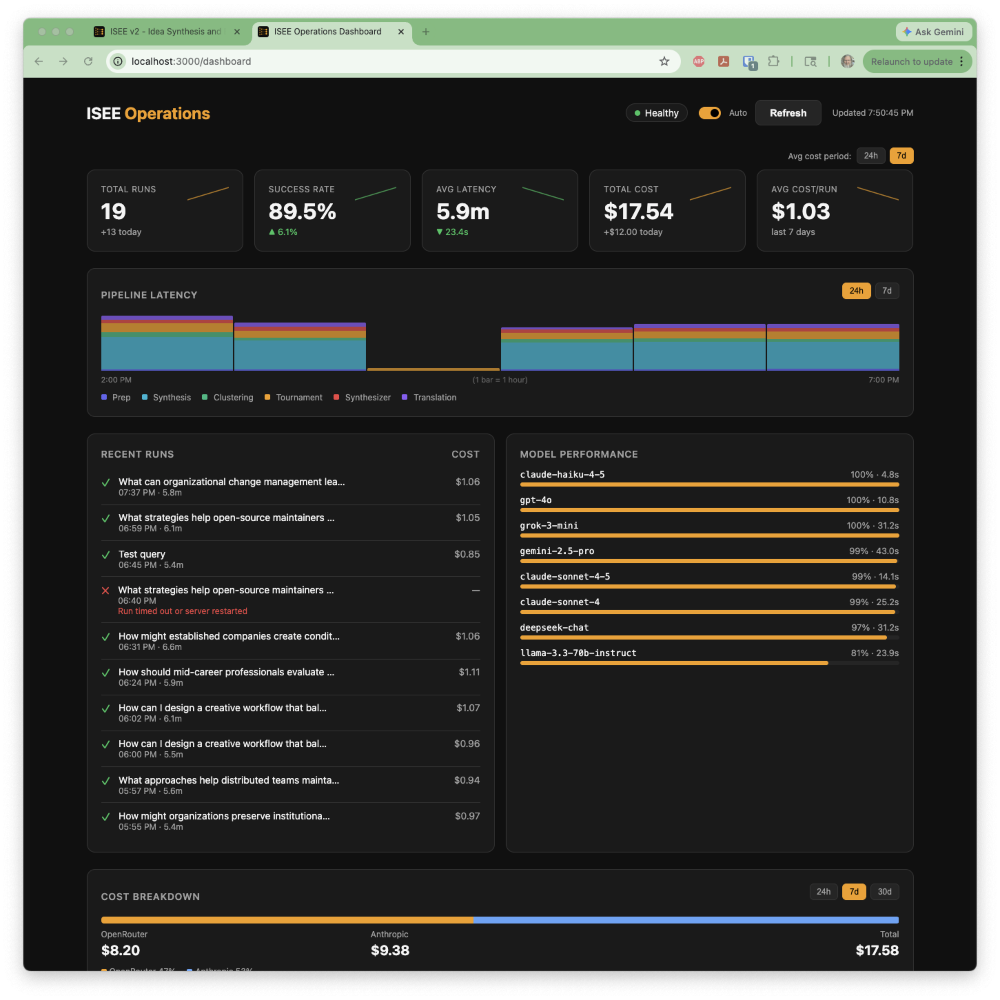

# ISEE v2

**Idea Synthesis and Extraction Engine**

ISEE is a thinking amplifier that expands the possibility space through combinatorial synthesis, then extracts 3 breakthrough ideas through rigorous emergent evaluation.

> See [OVERVIEW.md](./docs/OVERVIEW.md) for a detailed explanation of how ISEE works.

## Screenshots

<p align="center">
  
  <br><em>Enter your question — ISEE will explore it from dozens of perspectives</em>
</p>

<p align="center">
  
  <br><em>Watch the pipeline work: 66 LLM calls → clustering → tournament debate → synthesis</em>
</p>

<p align="center">
  
  <br><em>Operations dashboard with real-time metrics, cost tracking, and model performance</em>
</p>

## Quick Start

```bash
# Install dependencies
bun install

# Copy environment template and add your API keys
cp .env.template .env
```

You'll need two API keys:
- **Anthropic** — for pipeline agents (clustering, tournament, synthesis)
- **OpenRouter** — for multi-model synthesis (GPT-4o, Gemini, Llama, etc.)

```bash
# Run the development server
bun run dev

# Open http://localhost:3000 for the web UI
# Open http://localhost:3000/dashboard for operations metrics
```

## Status

ISEE v2 is fully functional and production-ready.

### Core Pipeline
- Smart query refinement with follow-up questions
- Multi-model synthesis (6 models × 11 cognitive frameworks × dynamic domains)
- Emergent clustering by intellectual angle
- Advocate/Skeptic/Rebuttal tournament debate
- Plain-language briefings with concrete action items

### Operations Dashboard
- Real-time metrics with sparkline trends
- Pipeline latency breakdown by stage
- Cost tracking per run and per model (~$1/run average)
- Model performance monitoring (success rates, P95 latency)
- System health checks with circuit breaker status

### Infrastructure
- Dual-provider architecture (OpenRouter + Anthropic)
- Circuit breaker resilience for API failures
- SQLite persistence for runs and metrics
- OpenTelemetry tracing

## Documentation

| Document | Purpose |
|----------|---------|
| [OVERVIEW.md](./docs/OVERVIEW.md) | What ISEE is, how it works, what you get |
| [PRD.md](./docs/PRD.md) | Product requirements, design principles, scope |
| [ARCHITECTURE.md](./docs/ARCHITECTURE.md) | Technical design, data contracts, project structure |
| [CLAUDE.md](./CLAUDE.md) | Developer conventions for AI coding assistants |

## License

MIT
